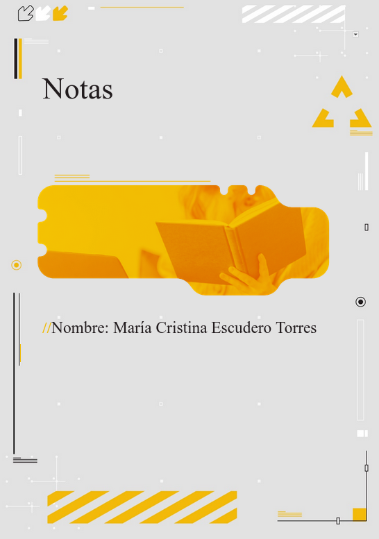

  

# Aqui guardare enlaces o cosas interesantes/importantes
## También cosas de clase

---

## Índice
- [Lista ordenada](#lista-ordenada)
- [Lista desordenada](#lista-desordenada)
- [Enlaces](#enlaces)
- [Imagen](#imagen)
- [Tabla de pikmins](#tabla-de-pikmins)

---

<!-- Esto es un parrafo y **esto esta en negrita** , *esto esta en cursiva* y `esto esta en codigo` -->

## Enlaces para diseño web
1. [Botones, Tarjetas, etc](https://uiverse.io/)
2. [Cajas](https://neumorphism.io/#deddda)

## Enlaces de webs bonitas/bien diseñadas
1. [Página del tarot](https://tarotoo.com/es/)
2. [Página de pasta de dientes](https://www.marvis.com/spain/es/)

## Imagen de ejemplo

## Tabla de pikmins por que si

| Nombre   | Color     | Resistencia  |
|----------|----------:|--------------|
| Pikmin1  | Rojo      | Fuego        |
| Pikmin2  | Amarillo  | Electricidad |
| Pikmin3  | Azul      | Agua         |
